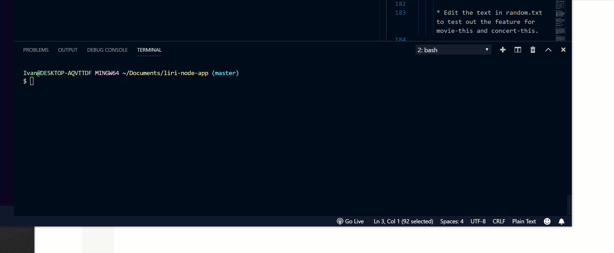

# liri-node-app
a song, concert and move cli for console searches through Spotify and OMDB's API's.

# Directions
* **concert-this 'artist name'** will return next show information about where artist will be performing.
* **spotify-this-song 'song name'** will return information about the selected song
* **movie-this 'movie name'** will return information about seleceted movie
* **do-what-it-says** will run any of the previous cammands that are written in a seperate random.txt file

# gif of how it works

